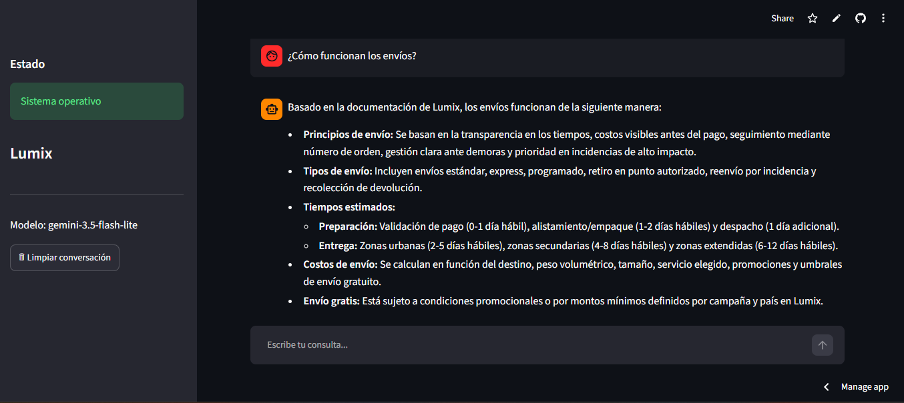

# Lumix AI Assistant

Asistente inteligente desarrollado como proyecto de aprendizaje sobre arquitecturas **RAG (Retrieval-Augmented Generation)**.

El proyecto implementa una arquitectura RAG para responder consultas utilizando exclusivamente la documentación interna almacenada en documentos PDF.

La aplicación permite realizar preguntas en lenguaje natural, recuperar automáticamente la información más relevante desde una base vectorial (ChromaDB) y generar respuestas utilizando Google Gemini únicamente con el contexto recuperado.

---

# 🎯 Objetivo

Desarrollar un asistente capaz de:

- Consultar documentación interna mediante lenguaje natural.
- Recuperar automáticamente los fragmentos más relevantes.
- Generar respuestas basadas únicamente en la documentación disponible.
- Reducir respuestas inventadas cuando la información no existe.
- Mostrar los documentos utilizados para responder cada consulta.

---

# ✨ Características

- Lectura automática de documentos PDF.
- División de documentos en fragmentos (Chunking).
- Generación de embeddings mediante Sentence Transformers.
- Indexación semántica utilizando ChromaDB.
- Recuperación de documentos mediante búsqueda vectorial.
- Generación de respuestas utilizando Google Gemini.
- Respuestas fundamentadas únicamente en la documentación indexada.
- Interfaz conversacional desarrollada con Streamlit.
- Visualización de los documentos consultados para cada respuesta.

---

# 🏗 Arquitectura

El proyecto sigue una arquitectura **Retrieval-Augmented Generation (RAG)**.

Flujo de funcionamiento:

1. El usuario realiza una consulta desde la interfaz web.
2. El Retriever busca los fragmentos más relevantes en ChromaDB.
3. Los documentos recuperados se utilizan como contexto.
4. Google Gemini genera una respuesta utilizando exclusivamente dicho contexto.
5. La respuesta se muestra junto con los documentos consultados.

```text
Usuario
   │
   ▼
Interfaz Streamlit
   │
   ▼
Retriever
   │
   ▼
ChromaDB
   │
   ▼
Google Gemini
   │
   ▼
Respuesta
```

---

# 🛠 Tecnologías utilizadas

- Python 3.13
- Streamlit
- LangChain
- ChromaDB
- Sentence Transformers
- Google Gemini API
- python-dotenv

---

# 🚀 Instalación

## 1. Clonar el repositorio

```bash
git clone https://github.com/GabyC3/lumix-rag-assistant.git
```

## 2. Ingresar al proyecto

```bash
cd lumix-rag-assistant
```

## 3. Crear un entorno virtual

```bash
python -m venv .venv
```

## 4. Activar el entorno virtual

### Windows

```bash
.venv\Scripts\activate
```

### Linux / macOS

```bash
source .venv/bin/activate
```

## 5. Instalar las dependencias

```bash
pip install -r requirements.txt
```

---

# ⚙ Configuración

Crear un archivo `.env` en la raíz del proyecto.

```env
GEMINI_API_KEY=tu_api_key
GEMINI_MODEL=gemini-3.5-flash-lite
```

---

# 📚 Indexación de documentos

Antes de iniciar la aplicación es necesario indexar los documentos ubicados en la carpeta:

```text
data/documents
```

Ejecutar:

```bash
python index_documents.py
```

Este proceso:

- Carga los documentos PDF.
- Divide el contenido en fragmentos (Chunks).
- Genera los embeddings.
- Crea la base vectorial utilizando ChromaDB.

---

# ▶ Ejecución

Una vez configurada la API e indexados los documentos:

```bash
streamlit run streamlit_app.py
```

Luego abrir el navegador en la dirección indicada por Streamlit.

---

# 🖼 Capturas de pantalla

## Consulta y respuesta



# 💬 Ejemplos de consultas

- ¿Cómo funciona la garantía?
- ¿Que evidencia se requiere para la devolucion?
- ¿Qué métodos de pago están disponibles?
- ¿Cómo funcionan los envíos?

---

Este proyecto esta desplegado y activo en: https://lumix-ai.streamlit.app/

# 👨‍💻 Autor

Proyecto desarrollado por Gabriel Condori como práctica para el Challenge Alura Agentes 2026
